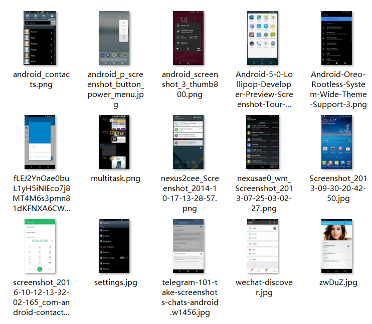
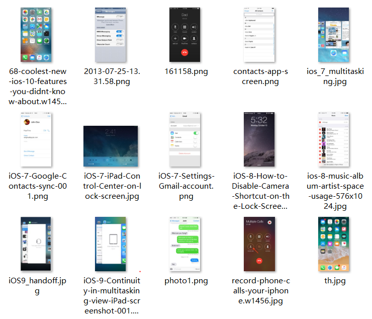
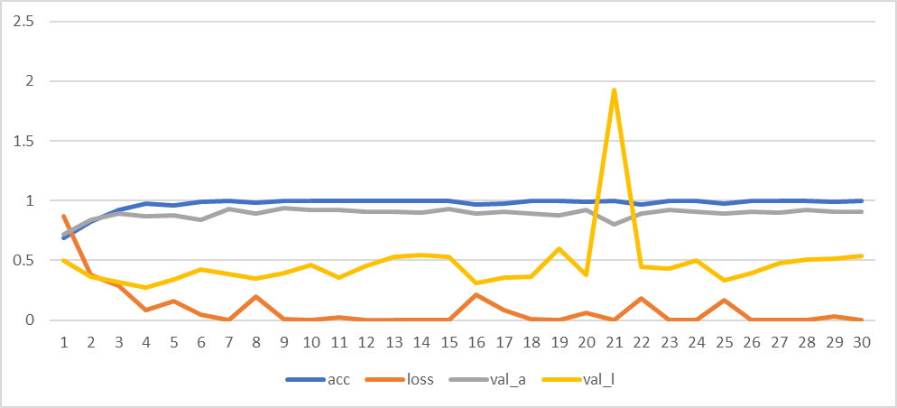
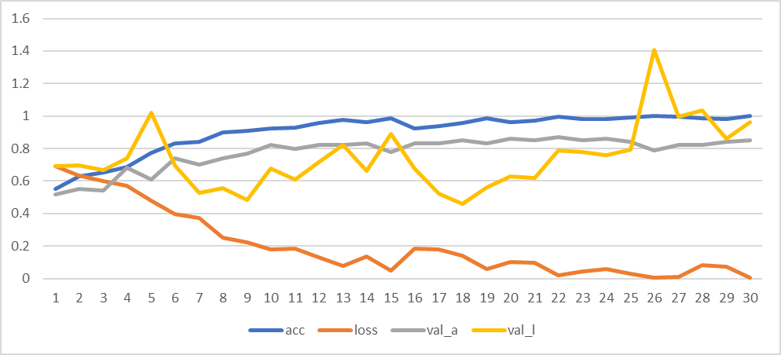

# IsThisAori

A failed attempt to distinguish between Android/iOS screenshots, with Deep learning algorithm.

## Introduction

Some people will tell whether the mobile phone is an geneine iPhone or an Android one, by looking at its screen and find UI features, while a lot of people do not mind. Can we teach the machine to do this?

The input here is a screenshot image of the mobile screen, and the program will output a value between 0 (Android) to 1 (iOS), representing whether this image comes from Android or iOS.

Though the model inside is so bad, that it's better to just get a random result, I provide a simple API for you to use this.

As a project in a course, I have achieved:

- Use TensorFlow to (attempt to) recognize between two classes of objects.
- Capture the images myself and tag them. Design own Training, Testing and Verification sets.
- Compare between two different systems based on the literature review.
- Provide an API with example code for another developer to use the system.

## TL;DR - Show the code!

Firstly you need to install Python 3+, and some requirements (which is large, so it's better to use Anaconda or some virtual enviroument). If you are already doing deep learning (with TensorFlow), usually you are good.

```
$ pip install -r requirements.txt
```

And you need to either download the dataset (images-v1.zip, and please unzip after downloading it), or the model (model-1.hdf5 or model-2.hdf5, by default the program will read model.hdf5) at Google Drive: https://drive.google.com/drive/folders/1MqeYuE2KYhQ5eNaotoPqPn236Zl6EohN?usp=sharing

`main.py` is the main function code. If you want to adjust training configuration you should look inside and change it.

`train.py` will train images under `images/train` folder. You need to download the dataset first.

`evaluate.py` can evaluate images under `images/evaluate` folder. *Also you can pass the path of the image (as the argument) or `stdin` the file to get prediction results. Or you can predict by: (TODO)*

```python
# TODO
import main
result = main.evaluate('yunos.jpg')
if result.label == 'android':
    print('See this is {:.0%} Android! FAKE NEWS!'.format(1-result.value))
else:
    print('Wow, how can this be iOS! {:.0%} likeness!'.format(result.value))
```

## Dataset

I collected the image dataset myself. Unfortunately the amount is small (because I am unable to work full time as a spider): I collected 255 images each of Android and iOS interface, from Google Image Search. This is a high quality, copyright-danger dataset because I used no bot to collect them, and categorized them with my years of experience (100% accuracy) and no-brainer copy-and-paste (without looking at copyright issues). These 255 + 255 images are **the images for training**, in which 30% are **validation set**, and others are **training set**.

These images mainly include:

- lock screen (iOS/Android/MIUI/Huawei)
- home screen (iOS/Android/MIUI/Huawei)
- call screen (iOS/Android/MIUI/Huawei)
- Calendar (iOS/Android)
- Mail (iOS/Android)
- Settings (iOS/Android/MIUI/Huawei)
- iMessage / SMS (iOS/Android/MIUI/Huawei)
- Safari (iOS) / Chrome (Android)
- Some Android version easter eggs
- WeChat (iOS/Android)
- One or two iPad screenshots (iOS)

There are only two labels: `android` and `ios`. This is indicated by puting into the right folder.

There is an extra evaluation set, from Bing Image Search, representing several occasions above. 15 for Android, 15 for iOS. Includes contacts interface, which never exists in the images for training.




Web images usually include the phone's appearence, which (I think) is bad. This is the most significant challenges when grabing images online. The dataset doesn't include any of the phone's cover.

## Models (Systems)

### Google machine learning practica's CNN

I firstly use [Google machine learning practica](https://developers.google.com/machine-learning/practica/image-classification/exercise-1) to make a basic CNN model.

```
Layer (type)                 Output Shape              Param #
=================================================================
conv2d (Conv2D)              (None, 148, 148, 16)      448
_________________________________________________________________
max_pooling2d (MaxPooling2D) (None, 74, 74, 16)        0
_________________________________________________________________
conv2d_1 (Conv2D)            (None, 72, 72, 32)        4640
_________________________________________________________________
max_pooling2d_1 (MaxPooling2 (None, 36, 36, 32)        0
_________________________________________________________________
conv2d_2 (Conv2D)            (None, 34, 34, 64)        18496
_________________________________________________________________
max_pooling2d_2 (MaxPooling2 (None, 17, 17, 64)        0
_________________________________________________________________
flatten (Flatten)            (None, 18496)             0
_________________________________________________________________
dense (Dense)                (None, 512)               9470464
_________________________________________________________________
dropout (Dropout)            (None, 512)               0
_________________________________________________________________
dense_1 (Dense)              (None, 1)                 513
=================================================================
Total params: 9,494,561
Trainable params: 9,494,561
Non-trainable params: 0
```

Training metrics:



Validate through training data (rand(om choices) ~ 50%):

```
android: 121/255 (47.5%, rand: 53.3%)
ios: 121/255 (47.5%, rand: 52.5%)
loss = 0.06967834805654288
acc = 0.9764705837941637
```

Evaluate through evaluation data (rand(om choices) ~ 50%):

```
android: 9/15 (60.0%, rand: 66.7%)
ios: 6/15 (40.0%, rand: 53.3%)
loss = 0.5314447948088249
acc = 0.8333333333333334
```

### pix2code's CNN

Also I heard about ["auto-generation of UI code" project](https://github.com/emilwallner/Screenshot-to-code-in-Keras) before. This is a project about UI too, so I digged into it and found they use a conbination of CNN and LSTM. The CNN is trying to encode the UI structure, specifically it is a VGGNet. I looked into the implementation and try to adapt that into this application.

```
Layer (type)                 Output Shape              Param #
=================================================================
conv2d (Conv2D)              (None, 148, 148, 32)      896
_________________________________________________________________
conv2d_1 (Conv2D)            (None, 146, 146, 32)      9248
_________________________________________________________________
max_pooling2d (MaxPooling2D) (None, 73, 73, 32)        0
_________________________________________________________________
dropout (Dropout)            (None, 73, 73, 32)        0
_________________________________________________________________
conv2d_2 (Conv2D)            (None, 71, 71, 64)        18496
_________________________________________________________________
conv2d_3 (Conv2D)            (None, 69, 69, 64)        36928
_________________________________________________________________
max_pooling2d_1 (MaxPooling2 (None, 34, 34, 64)        0
_________________________________________________________________
dropout_1 (Dropout)          (None, 34, 34, 64)        0
_________________________________________________________________
conv2d_4 (Conv2D)            (None, 32, 32, 128)       73856
_________________________________________________________________
conv2d_5 (Conv2D)            (None, 30, 30, 128)       147584
_________________________________________________________________
max_pooling2d_2 (MaxPooling2 (None, 15, 15, 128)       0
_________________________________________________________________
dropout_2 (Dropout)          (None, 15, 15, 128)       0
_________________________________________________________________
flatten (Flatten)            (None, 28800)             0
_________________________________________________________________
dense (Dense)                (None, 1024)              29492224
_________________________________________________________________
dropout_3 (Dropout)          (None, 1024)              0
_________________________________________________________________
dense_1 (Dense)              (None, 1024)              1049600
_________________________________________________________________
dropout_4 (Dropout)          (None, 1024)              0
_________________________________________________________________
dense_2 (Dense)              (None, 1)                 1025
=================================================================
Total params: 30,829,857
Trainable params: 30,829,857
Non-trainable params: 0
```

Training metrics:



Validate through training data (rand(om choices) ~ 50%):

```
android: 127/255 (49.8%, rand: 50.2%)
ios: 133/255 (52.2%, rand: 54.5%)
loss = 0.20029735419095732
acc = 0.9490196027007758
```

Evaluate through evaluation data (rand(om choices) ~ 50%):

```
android: 9/15 (60.0%, rand: 53.3%)
ios: 5/15 (33.3%, rand: 40.0%)
loss = 0.8171522617340088
acc = 0.800000011920929
```

### Comparison

Note that each training takes approximately half an hour. Also I only keep the model with least validation loss (not the final moment!). This is a binary problem, so we choose `categorical_crossentropy` as the loss function.

- Training Data Correctness
  - Android: 121/127 (total 255)
  - iOS: 121/133 (total 255)
  - loss: 0.07/0.20 (lower better)
  - accuracy: 0.98/0.95 (higher better)
- Evaluation Data Correctness
  - Android: 9/9 (total 15)
  - iOS: 6/5 (total 15)
  - loss: 0.53/0.81 (lower better)
  - accuracy: 0.83/0.80 (higher better)

The two systems are both CNN, but the secoud one has more layers. Some of the layers might looks repeated, but in large datasets the model will be better suited. However because in this application dataset is limited, the model with less layers performs better.

As you can see the result is bad in both models. Also the accuracy metric is weirdly high (compared to correctness counter), and I have to look into how this is calculated. To check where the problem is, I will use other datasets to validate the model and accommanied code.

## References

1. Beltramelli, Tony. "pix2code: Generating code from a graphical user interface screenshot." Proceedings of the ACM SIGCHI Symposium on Engineering Interactive Computing Systems. ACM, 2018.

2. Simonyan, Karen, and Andrew Zisserman. "Very deep convolutional networks for large-scale image recognition." arXiv preprint arXiv:1409.1556 (2014).